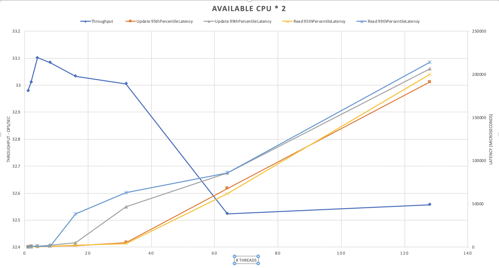
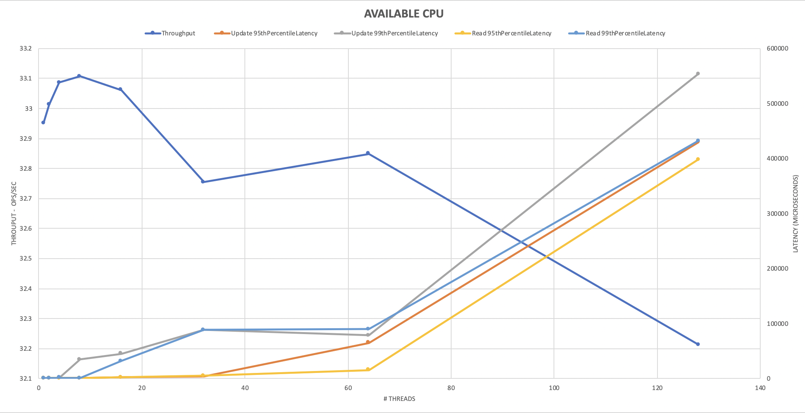

# Memcached Server
Simple Java / Netty Memcached server

The server supports these commands. 
* GET 
* SET 
* ADD
* REPLACE

Command syntax is based on Memcached ASCII protocol. For more information refer to https://github.com/memcached/memcached/blob/master/doc/protocol.txt

## Prerequisites

1. java8 [setup](https://www.oracle.com/java/technologies/javase-jre8-downloads.html)
2. maven [setup](https://maven.apache.org/install.html)

## Packages

**Server**: Simple Netty based Server

**Client**: Extremely simple client. It is based on `com.whalin` lib. I am using it for <u>**basic smoketesting**</u>. For load testing please check below

## Build 

From Server folder run the following maven command: `mvn install`

## Running 

From Server folder run the following maven command: `mvn exec:java`

## Changing Log Level

Default log level is `INFO` 

To change the level  set `log4j.rootLogger=<Level>` in [log4j2.xml](./Server/src/main/resources/log4j.properties)

You will need to rebuild the server : `mvn install`

Note: `DEBUG` level is very verbose so setting log level to `DEBUG` will have negative effet on performance.

## Changing Server Configuration

Configuration is based on Java Properties file [config.properties](./Server/src/main/resources/config.properties)

All configration have default values, these values are specified at [ServerProperties.java](./Server/src/main/java/protocol/ServerProperties.java) 

Example: 

`public static PropertyKey<Integer> PORT = new IntegerPropertyKey("port", 11211)`

`("port", 11211)`: 1st value is the key, 2nd is the default value so to override the PORT, just add in config.properties `port=1234`

## Design 

Please refer to [Docs Folder](./Server/docs)

## Monitoring 

Currently Server monitoring is limitted. We only have a thread that runs every X mins (default is 1 min) and will "report"* CacheStats. 

CacheStats currenly has, HitCount, MissCount, EvictionCount 

`[CacheStats-StatsReporter] cache.CacheStats$StatsReporter  - CacheStats - Hit Count: 0, Miss Count: 0, Evicted: 0`

*"Report" in the current system means Log, but that can be changed to publish these KPIs to another service and setup alerting around it 

## Testing/ Load testing

I used **YCSB** for benchmarking. For more information, refer to  
https://github.com/brianfrankcooper/YCSB/wiki/Running-a-Workload

https://github.com/brianfrankcooper/YCSB/tree/master/memcached

https://github.com/brianfrankcooper/YCSB/wiki/Core-Properties

### Benchmark result

Env: 

* MacBook Pro 
  * Processor: 2.4 GHz 8-Core Intel Core i9
  * Memory: 64 GB 2667 MHz DDR4

**Note: Both YCSB Client and Server are running on the same machine**

This table shows a quick run of **Load** and **Run** using **YCSB** targeting both my new cache and memcached. 
It is for 1000000 operations (records)

|          | My Server                                                    | Memcached                                                    |
| :------- | :----------------------------------------------------------- | ------------------------------------------------------------ |
|          | `mvn exec:java`                                              | `memcached -p 11211 -vv`                                     |
| **Load** | [OVERALL], RunTime(ms), 86905 [OVERALL], Throughput(ops/sec), 11506.817789540302 [TOTAL_GCS_PS_Scavenge], Count, 449 [TOTAL_GC_TIME_PS_Scavenge], Time(ms), 290 [TOTAL_GC_TIME_%_PS_Scavenge], Time(%), 0.33369771589666875 [TOTAL_GCS_PS_MarkSweep], Count, 0 [TOTAL_GC_TIME_PS_MarkSweep], Time(ms), 0 [TOTAL_GC_TIME_%_PS_MarkSweep], Time(%), 0.0 [TOTAL_GCs], Count, 449 [TOTAL_GC_TIME], Time(ms), 290 [TOTAL_GC_TIME_%], Time(%), 0.33369771589666875 [CLEANUP], Operations, 1 [CLEANUP], AverageLatency(us), 3.0007296E7 [CLEANUP], MinLatency(us), 29999104 [CLEANUP], MaxLatency(us), 30015487 [CLEANUP], 95thPercentileLatency(us), 30015487 [CLEANUP], 99thPercentileLatency(us), 30015487 [INSERT], Operations, 1000000 [INSERT], AverageLatency(us), 55.269037 [INSERT], MinLatency(us), 40 [INSERT], MaxLatency(us), 500479 [INSERT], 95thPercentileLatency(us), 61 [INSERT], 99thPercentileLatency(us), 103 [INSERT], Return=OK, 1000000 | [OVERALL], RunTime(ms), 66718 [OVERALL], Throughput(ops/sec), 14988.458886657274 [TOTAL_GCS_PS_Scavenge], Count, 449 [TOTAL_GC_TIME_PS_Scavenge], Time(ms), 268 [TOTAL_GC_TIME_%_PS_Scavenge], Time(%), 0.401690698162415 [TOTAL_GCS_PS_MarkSweep], Count, 0 [TOTAL_GC_TIME_PS_MarkSweep], Time(ms), 0 [TOTAL_GC_TIME_%_PS_MarkSweep], Time(%), 0.0 [TOTAL_GCs], Count, 449 [TOTAL_GC_TIME], Time(ms), 268 [TOTAL_GC_TIME_%], Time(%), 0.401690698162415 [CLEANUP], Operations, 1 [CLEANUP], AverageLatency(us), 2643.0 [CLEANUP], MinLatency(us), 2642 [CLEANUP], MaxLatency(us), 2643 [CLEANUP], 95thPercentileLatency(us), 2643 [CLEANUP], 99thPercentileLatency(us), 2643 [INSERT], Operations, 1000000 [INSERT], AverageLatency(us), 65.204713 [INSERT], MinLatency(us), 42 [INSERT], MaxLatency(us), 103167 [INSERT], 95thPercentileLatency(us), 90 [INSERT], 99thPercentileLatency(us), 138 [INSERT], Return=OK, 1000000 |
|          |                                                              |                                                              |
| **Run**  | [OVERALL], RunTime(ms), 30370 [OVERALL], Throughput(ops/sec), 32.927230819888045 [TOTAL_GCS_PS_Scavenge], Count, 0 [TOTAL_GC_TIME_PS_Scavenge], Time(ms), 0 [TOTAL_GC_TIME_%_PS_Scavenge], Time(%), 0.0 [TOTAL_GCS_PS_MarkSweep], Count, 0 [TOTAL_GC_TIME_PS_MarkSweep], Time(ms), 0 [TOTAL_GC_TIME_%_PS_MarkSweep], Time(%), 0.0 [TOTAL_GCs], Count, 0 [TOTAL_GC_TIME], Time(ms), 0 [TOTAL_GC_TIME_%], Time(%), 0.0 [READ], Operations, 512 [READ], AverageLatency(us), 252.056640625 [READ], MinLatency(us), 84 [READ], MaxLatency(us), 9879 [READ], 95thPercentileLatency(us), 480 [READ], 99thPercentileLatency(us), 684 [READ], Return=OK, 512 [CLEANUP], Operations, 1 [CLEANUP], AverageLatency(us), 3.0007296E7 [CLEANUP], MinLatency(us), 29999104 [CLEANUP], MaxLatency(us), 30015487 [CLEANUP], 95thPercentileLatency(us), 30015487 [CLEANUP], 99thPercentileLatency(us), 30015487 [UPDATE], Operations, 488 [UPDATE], AverageLatency(us), 277.84631147540983 [UPDATE], MinLatency(us), 82 [UPDATE], MaxLatency(us), 36415 [UPDATE], 95thPercentileLatency(us), 383 [UPDATE], 99thPercentileLatency(us), 587 [UPDATE], Return=OK, 488 | [OVERALL], RunTime(ms), 310 [OVERALL], Throughput(ops/sec), 3225.8064516129034 [TOTAL_GCS_PS_Scavenge], Count, 0 [TOTAL_GC_TIME_PS_Scavenge], Time(ms), 0 [TOTAL_GC_TIME_%_PS_Scavenge], Time(%), 0.0 [TOTAL_GCS_PS_MarkSweep], Count, 0 [TOTAL_GC_TIME_PS_MarkSweep], Time(ms), 0 [TOTAL_GC_TIME_%_PS_MarkSweep], Time(%), 0.0 [TOTAL_GCs], Count, 0 [TOTAL_GC_TIME], Time(ms), 0 [TOTAL_GC_TIME_%], Time(%), 0.0 [READ], Operations, 501 [READ], AverageLatency(us), 214.39520958083833 [READ], MinLatency(us), 65 [READ], MaxLatency(us), 21071 [READ], 95thPercentileLatency(us), 336 [READ], 99thPercentileLatency(us), 522 [READ], Return=OK, 501 [CLEANUP], Operations, 1 [CLEANUP], AverageLatency(us), 2015.0 [CLEANUP], MinLatency(us), 2015 [CLEANUP], MaxLatency(us), 2015 [CLEANUP], 95thPercentileLatency(us), 2015 [CLEANUP], 99thPercentileLatency(us), 2015 [UPDATE], Operations, 499 [UPDATE], AverageLatency(us), 201.42885771543087 [UPDATE], MinLatency(us), 74 [UPDATE], MaxLatency(us), 19887 [UPDATE], 95thPercentileLatency(us), 289 [UPDATE], 99thPercentileLatency(us), 387 [UPDATE], Return=OK, 499 |

#### **Re-run test** 

Load Command

`./bin/ycsb load memcached -s -P workloads/workloada -p "memcached.hosts=127.0.0.1" -p recordcount=1000000` 

Run Command 

`./bin/ycsb run memcached -s -P workloads/workloada -p "memcached.hosts=127.0.0.1" -p recordcount=1000000`

#### Throughput/Latency vs #Threads. 

This is also quick round of analysis I did using YCSB, it shows Throughput/Latency vs #Threads. 

Used **Workloada** with **3 millions record** (Operations)

Load: 

`./bin/ycsb load memcached -s -P workloads/workloada -p "memcached.hosts=127.0.0.1" -p recordcount=3000000`

Run: 

`./bin/ycsb run memcached -s -P workloads/workloada -p "memcached.hosts=127.0.0.1" -p recordcount=3000000  -p threadcount=X` 

I did multiple runs using different client thread count `threadcount=X`. I ran with 1, 2, 4, 8, 16, 32, 64, 128 

The difference between the two charts below is 

* The 1st shows the effect of initializing Netty Thread pool (on the server) with the full number of processors available on my mac
* The 1st shows the effect of initializing Netty Thread pool (on the server) with half of the number of processors available on my mac

You can see that the latency is cut to half when using more threads on the sever. I wanted to get a sense of how the numbers will change if more processors are added to the server. One thing to watch out for (that is effecting this experiment) is that both the YCSB client and my server are running on the same machine  

