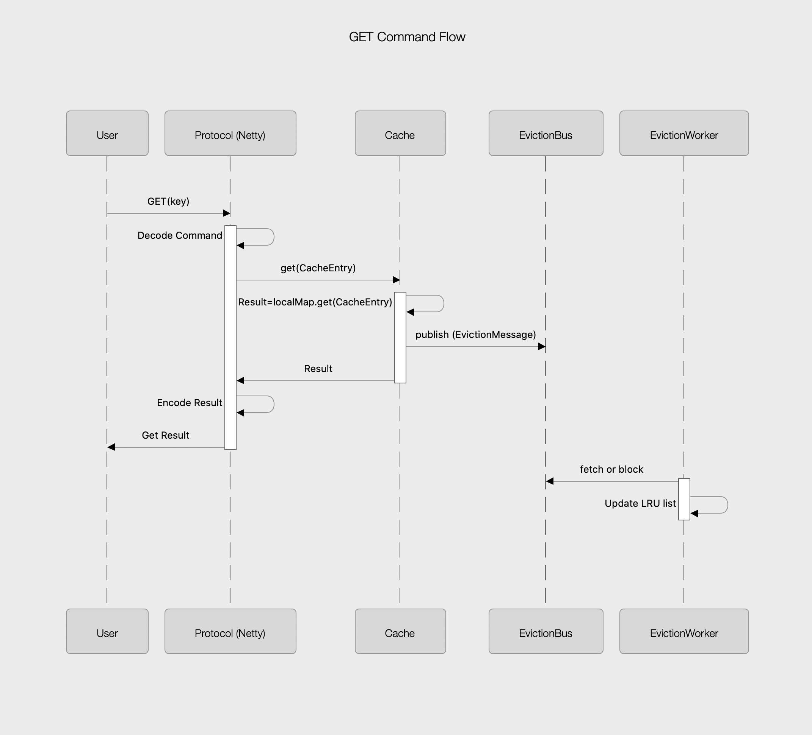

# High level design 

Most MemCached uses HashTable a long with a LinkedList for eviction policy. Making this design highly concurrent isn't easy becasue for every operation eviction List has to be updated. 

Concurrency can be achieved by using lock around the entire HashTable for every access that requires updating the eviction policy but soon we will end up with serial access and degraded performance. 

One way to overcome that is by breaking the in memory HashTable into multiple smaller HashTables and use the key (or part of the key) + Hash Function for routing (Finding out which HashTable a given key belongs to). Partitioning the HashTable will give you a better performance than having one big HashTable but we will have to deal with hot-spotting 

Another idea inspired by Object Storage Append Only Transaction Logs is that any operation is written into transaction log (TX File) and another set of threads (can be one thread) will take care of applying these transactions to the main DataStore. The advantage is the client threads are not blocked for a long time, just the required time to append to the TX file then return.

I decided to explore this pattern in my cache. So instead of updating the cache and eviction LinkedList right away, we will update the Cache and add an event (EvictionMessage) to a bus (EvictionBus) and return. Then another thread* will fetch messages form EvictionBus and update eviction LinkedList

Here is a sequence diagram for GET command for example.

​       

The rest of the command will have a similar flow! 

# Design implementation details
In my design I aimed for separating Client Protocol parsing from the actual Cache Store. The advantage of that is 
* Easily adopt new protocols
* Easily swap Cache implementation while still using the same protocol

So there are two packages under **'Server'** folder 
* **Protocol**
  
    * Which encapsulate all Netty Server details
    * Encode User input 
    * Decode Result         
    
    To support different commands I used **Command Pattern**. Each command encapsulate all the details needed to decode and execute this command. That makes adding new commands easy. 

* **Cache** 

  The actual Cache implementation. This layer doesn't know anything about Netty or the actual Protocol format 

  

